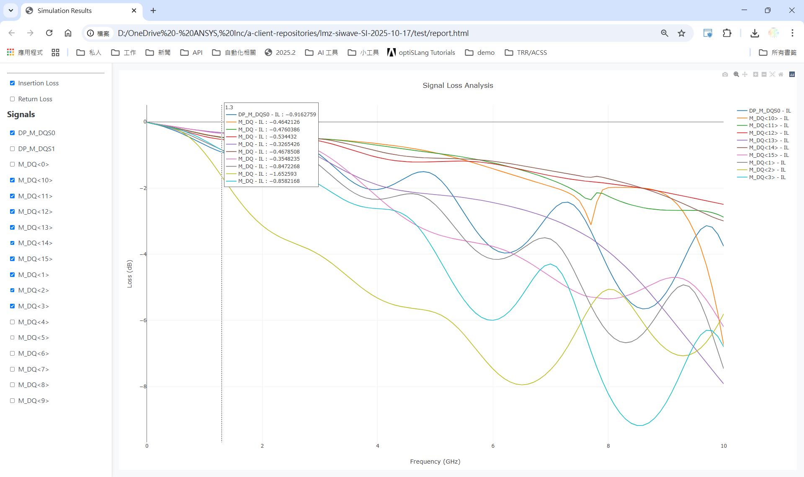

# SI/PI 自動化模擬工具平台

這是一個圖形化的自動化平台，旨在簡化並加速您的訊號完整性 (SI) 和電源完整性 (PI) 模擬分析流程。透過友善的使用者介面，您可以從導入設計、設定模擬參數到產生分析報告，全程自動化，大幅提升工作效率。


## 核心功能

- **多流程支援**: 在同一個平台中，您可以透過下拉式選單輕鬆切換不同的分析工作流程 (Apps)，滿足多樣化的模擬需求。
- **引導式操作**: 介面以頁籤 (Tab) 形式呈現，清晰地引導您完成每一步操作，從導入檔案到查看結果，流程一目了然。
- **一鍵式模擬**: 只需設定好參數，點擊按鈕即可自動執行複雜的後端模擬與資料處理，無需手動干預。
- **自動化報告**: 模擬完成後，平台能自動產生包含互動式圖表的HTML報告，讓您輕鬆查看與分享分析結果。



## 系統需求

- Python 3.10+
- Ansys Electronics Desktop (需包含 SIwave 功能)

## 安裝說明

1.  **克隆專案庫**
    ```bash
    git clone <repository_url>
    cd "SI Automation Flow"
    ```

2.  **建立虛擬環境**
    ```bash
    python -m venv .venv
    ```

3.  **啟動虛擬環境**
    ```powershell
    # Windows (PowerShell)
    .venv\Scripts\Activate.ps1
    ```
    ```bash
    # macOS/Linux
    source .venv/bin/activate
    ```

4.  **安裝依賴套件**
    ```bash
    pip install -r requirements.txt
    ```

## 使用方法

1.  **啟動應用程式**
    ```bash
    python src/main.py
    ```
2.  **選擇工作流程 (App)**
    - 啟動後，使用視窗左上角的下拉選單選擇您想要執行的工作流程（例如 "SI Automation Flow"）。
    - 介面將會根據您選擇的流程，動態載入對應的操作頁籤。
3.  **遵循流程指引**
    - 依照各頁籤的指示完成操作，例如導入設計、設定參數、執行模擬和查看結果。
