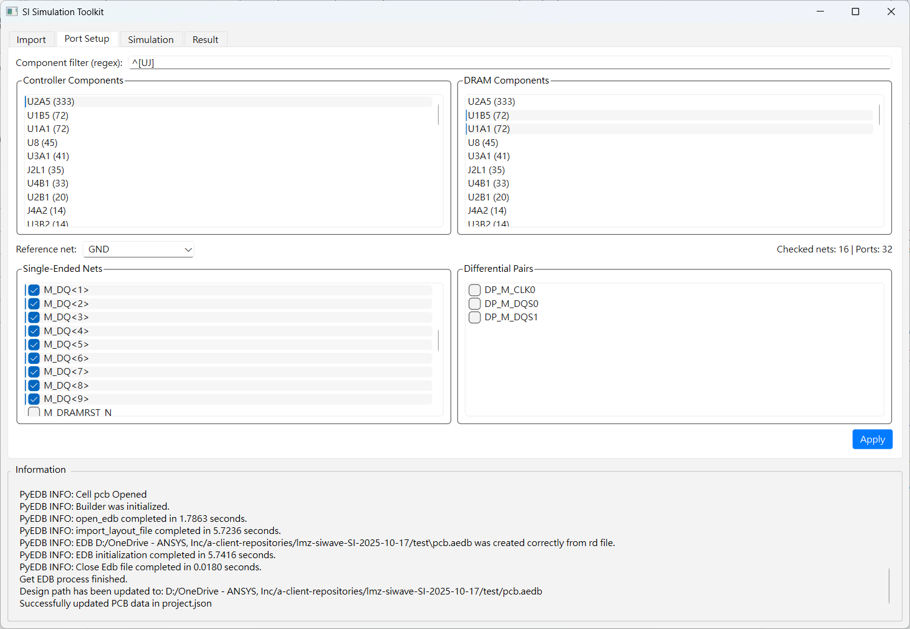

# SI/PI 自動化模擬工具平台

這是一個模組化的圖形化使用者介面 (GUI) 平台，用於自動化訊號完整性 (SI) 和電源完整性 (PI) 的模擬流程。此平台被設計為一個可擴充的多應用程式系統，不同的工作流程 (Apps) 可以作為獨立模組新增，並共享核心的UI元件和腳本。

## 主要特色

- **多App支援**: 透過下拉式選單在不同的工作流程App之間輕鬆切換。
- **模組化與可擴充**: 每個App都是一個獨立的模組，包含自己的設定檔和邏輯控制器。新增一個新的App只需在`apps`資料夾中建立一個新的子目錄，無需修改核心程式碼。
- **設定檔驅動**: 每個App的UI（顯示哪些頁籤）由其各自的`config.json`檔案定義，提供高度的靈活性。
- **共享元件庫**: 所有的App共享位於`src/tabs`的UI元件和`src/scripts`的後端處理腳本，最大化地重用程式碼。



## 專案結構

新的架構將UI、App邏輯和共享腳本分離：

```
SI Automation Flow/
├── apps/                   <-- 存放所有獨立的App模組
│   └── si_app/             <-- 範例：SI App
│       ├── config.json     <-- SI App的設定檔 (定義頁籤等)
│       └── controller.py   <-- SI App的商業邏輯
├── src/
│   ├── gui.py              <-- 主視窗框架與App載入器
│   ├── main.py             <-- 應用程式進入點
│   ├── scripts/            <-- 所有App共享的後端腳本
│   └── tabs/               <-- 所有App共享的UI頁籤元件
├── .gitignore
├── requirements.txt
└── ...
```

## 系統需求

- Python 3.10+
- Ansys Electronics Desktop (需包含 SIwave 功能)

## 安裝說明

1.  **克隆專案庫**
    ```bash
    git clone <repository_url>
    cd "SI Automation Flow"
    ```

2.  **建立虛擬環境**
    ```bash
    python -m venv .venv
    ```

3.  **啟動虛擬環境**
    ```powershell
    # Windows (PowerShell)
    .venv\Scripts\Activate.ps1
    ```
    ```bash
    # macOS/Linux
    source .venv/bin/activate
    ```

4.  **安裝依賴套件**
    ```bash
    pip install -r requirements.txt
    ```

## 使用方法

1.  **啟動應用程式**
    ```bash
    python src/main.py
    ```
2.  **選擇App**
    - 啟動後，使用視窗左上角的下拉選單選擇您想要執行的App（例如 "SI Automation Flow"）。
    - GUI將會根據該App的設定檔動態載入對應的頁籤。
3.  **遵循App流程**
    - 依照各頁籤的指示完成操作，例如導入設計、設定參數、執行模擬和查看結果。

## 如何擴充 (新增一個App)

平台的核心優勢在於其擴充性。要新增一個新的App（例如 "PI Analysis Flow"），請遵循以下步驟：

1.  **建立App資料夾**
    在 `apps/` 目錄下建立一個新的資料夾，例如 `apps/pi_app`。

2.  **建立 `config.json`**
    在 `apps/pi_app/` 中建立一個 `config.json` 檔案。此檔案定義了App的顯示名稱和它將使用的頁籤順序。頁籤的名稱必須對應`src/tabs/`中的檔案名稱（不含`.py`）。
    ```json
    {
      "display_name": "PI Analysis Flow",
      "tabs": [
        "import_tab",
        "pi_setup_tab",
        "simulation_tab",
        "result_tab"
      ],
      "settings": {
        "analysis_type": "Impedance"
      }
    }
    ```

3.  **建立 `controller.py`**
    在 `apps/pi_app/` 中建立一個 `controller.py` 檔案。這個檔案包含了該App獨有的商業邏輯。您需要建立一個名為 `AppController` 的類別，主程式會自動尋找並載入它。
    ```python
    from PySide6.QtCore import QObject

    class AppController(QObject):
        def __init__(self, app_name):
            super().__init__()
            self.app_name = app_name
            self.log_window = None
            self.tabs = {}
            print(f"Controller for '{self.app_name}' initialized.")

        def connect_signals(self, tabs):
            """
            將UI頁籤中的訊號連接到此控制器的方法。
            """
            self.tabs = tabs
            import_tab = tabs.get("import_tab")
            if import_tab:
                # 範例: import_tab.some_button.clicked.connect(self.do_something)
                pass

        def do_something(self):
            self.log("Doing something for PI App...")

        def log(self, message, color=None):
            if self.log_window:
                self.log_window.append(message)
    ```

完成以上步驟後，重新啟動應用程式 (`python src/main.py`)，新的 "PI Analysis Flow" App 將會自動出現在下拉選單中。

## External Script Runner

The `ExternalScriptRunner` centralises all long-running helper scripts so every tab can reuse a consistent queue, logging, and retry policy. The `AppController` exposes `run_external_script(...)` as a thin wrapper around the runner, which also keeps track of UI buttons and forwards log output to the shared log panel.

### Minimal example inside a tab

```python
import os
import sys
from PySide6.QtWidgets import QPushButton, QVBoxLayout, QWidget


class ExampleTab(QWidget):
    def __init__(self, controller):
        super().__init__()
        self.controller = controller
        layout = QVBoxLayout(self)

        self.run_button = QPushButton("Run Demo Script")
        layout.addWidget(self.run_button)
        self.run_button.clicked.connect(self.run_demo_task)

    def run_demo_task(self):
        script_path = os.path.join(
            self.controller.scripts_dir,
            "generate_report.py",
        )
        metadata = {
            "type": "demo_report",
            "description": "Generating demo report",
            "button": self.run_button,
            "button_style": self.run_button.styleSheet(),
            "button_reset_text": self.run_button.text(),
        }

        # `run_external_script` registers the task, so controller log handlers
        # automatically push stdout/stderr lines into the GUI log panel.
        self.controller.run_external_script(
            [sys.executable, script_path, "<path_to_project.json>"],
            metadata=metadata,
            input_path="<path_to_project.json>",
        )
```

Because the controller already wires the runner's `log_message` signal to the GUI log widget, any output produced by the script shows up automatically. The metadata payload also lets the controller manage button states and highlight failures without duplicating boilerplate inside each tab.
